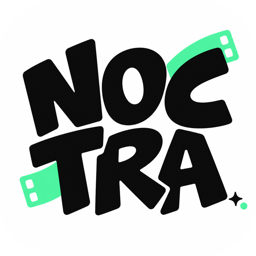
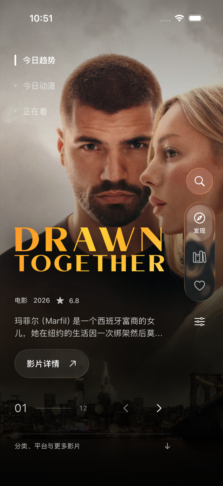
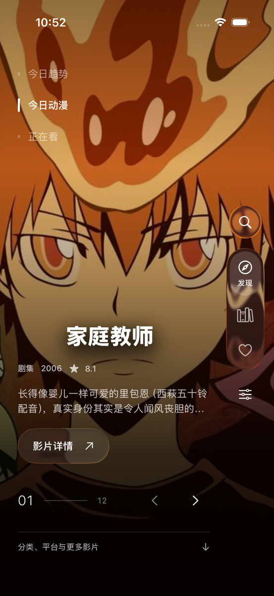

  
    
  <h1>Noctra</h1>
  
<b>家里几台服务器的片，一个地方看。</b>

  
适用于 iPhone 与 iPad 的原生媒体客户端 · Emby、Jellyfin、Plex、文件共享与 TVBox 网页源

  

    
    
    
  

  
<a href="https://github.com/Lincb522/Noctra/releases">版本记录</a> &nbsp; · &nbsp; <a href="https://github.com/Lincb522/Noctra/issues">反馈问题</a>

   
  
  &nbsp;&nbsp;
  

> 当前通过 TestFlight 内测发放，尚未上架 App Store。

## 服务器不止一台，入口只有一个

追剧页把所有服务器的最新、继续观看和收藏合在一起看，也能只看其中一台。搜索跨服务器进行，同一部片在几台服务器上都有的话，会归成一条并列出每个片源。

| 接入 | 说明 |
| :--- | :--- |
| Emby / Jellyfin / Plex | 每台独立登录，令牌只存在本机钥匙串；地址支持 HTTP 与 HTTPS |
| SMB / WebDAV / 本机文件夹 | 直接浏览目录播放，海报与观看进度由本机记录 |
| TVBox 网页源 | 读取站点配置，含站点脚本、直播列表和豆瓣分类 |
| 多线路 | 一台服务器保存局域网、公网、代理等多条地址，长按卡片即可切换；也能测响应耗时 |
| 服务器图标 | 从内置图标库挑一张，或贴任意图片直链 |
| iCloud 同步 | 服务器配置在自己的设备之间同步，可随时清空云端那份 |

添加服务器时，如果剪贴板里有地址、端口或账号信息，会先问一声再帮你填好。没连成功的可以先存为草稿。

## 私密空间

长按任意服务器选择「加入私密空间」，它就从追剧、搜索、聚合和收藏里消失，只留一张锁着的卡。用 Face ID 或设备密码验证后，这些服务器出现在自己的区块里；应用切到后台就自动重新锁上。

## 发现

首页读取 TMDB 的今日趋势、今日动漫、播出平台、分类、电影公司和高分内容，配合完整的影片详情：评分、分级、主创、演员、制作公司、预算、票房与类似影片。想看的片如果哪台服务器上有，详情页会直接列出来。

## 播放

| | |
| :--- | :--- |
| 引擎 | Noctra Core（默认）、mpv、KSPlayer、系统播放器，随时切换 |
| 画质 | 原画 / 4K、1080p、720p；转码可选编码与码率上限 |
| 解码 | VideoToolbox 硬解，可选软解；HDR 片源会被识别并在弹幕等叠层上相应处理 |
| 缓冲 | 缓冲时有明确的进度与速率提示；网络短暂中断会自动续读，而不是直接停下 |
| 字幕 | SRT、VTT、ASS / SSA 与图形字幕 SUP，可调样式、字号、时间偏移，内置中日韩字体 |
| 弹幕 | 弹弹play 兼容源与 Bilibili XML，屏蔽词、密度、字号、透明度、HDR 高亮都能调，弹幕多时也不掉帧 |
| 手势 | 画面横向三等份各自指定双击动作（播放 / 暂停、快进、快退），竖向滑动调亮度或音量，横向拖动进度，长按倍速可自定义，双指缩放 |

## 一点细节

- 点播放，详情页会收成一张光盘送进屏幕顶部的光驱；退出时退盘、回到原来的页面。
- 收藏成功从顶部打出一张票根，落下来停一会再消失。
- 海报有默认、票根、斜卡片三种样式；界面有经典与薄荷两套主题。
- 下拉刷新是一滴水的拉伸与融合。
- 这些动效都可以分别关掉，也跟随系统的「减弱动态效果」。

## 安装与反馈

1. 通过 TestFlight 邀请安装，要求 iOS / iPadOS 17 及以上。
2. 添加服务器，或者先逛逛发现页。
3. 遇到问题到 [Issues](https://github.com/Lincb522/Noctra/issues) 说明机型、系统版本和服务器类型。设置里可以导出运行日志，附上会更好定位。

---

**开发者：ZIJIU522**

此仓库仅用于产品说明、问题反馈和版本发布。应用源代码保存在私有仓库，不在此处公开。
