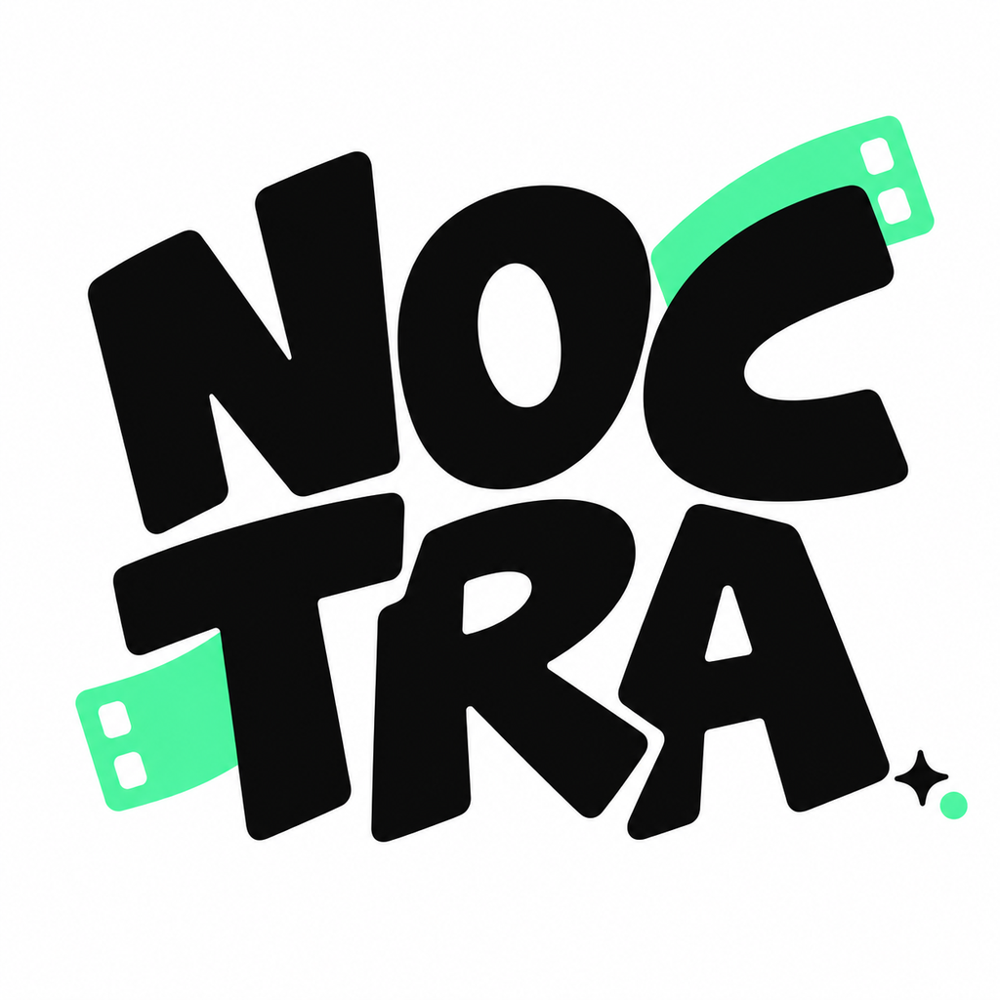
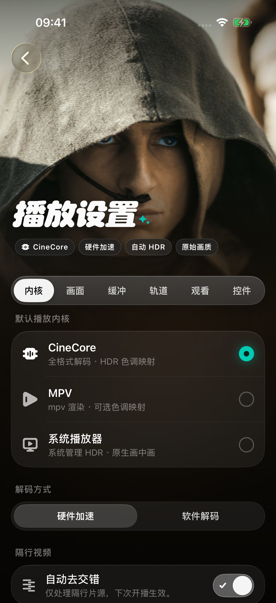
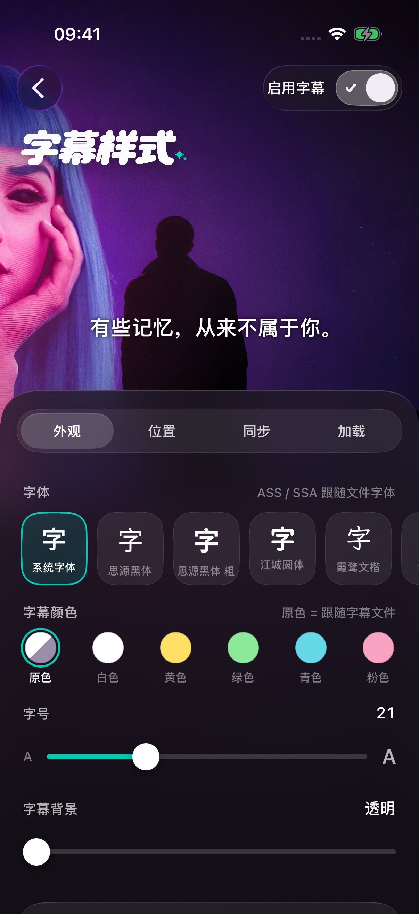
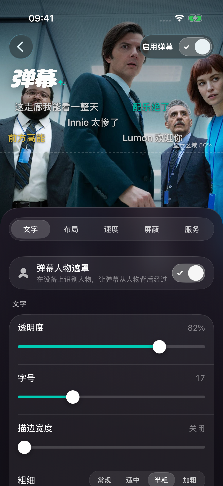
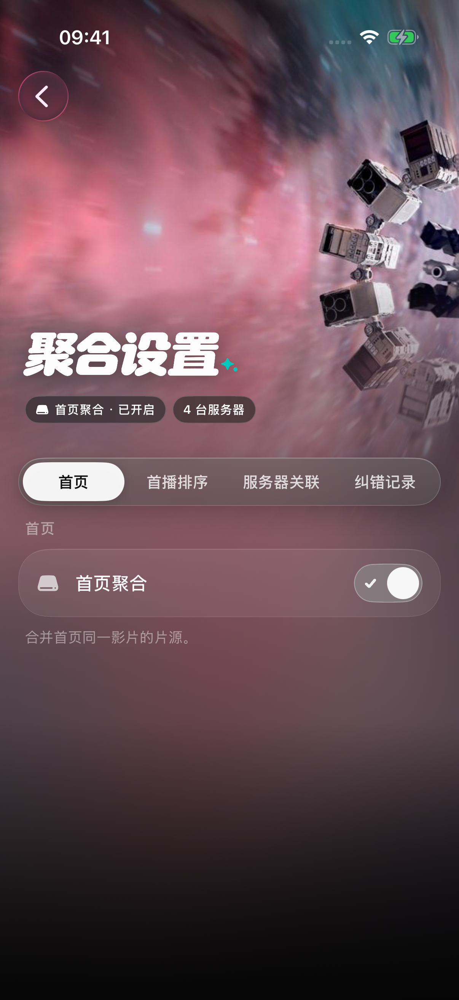
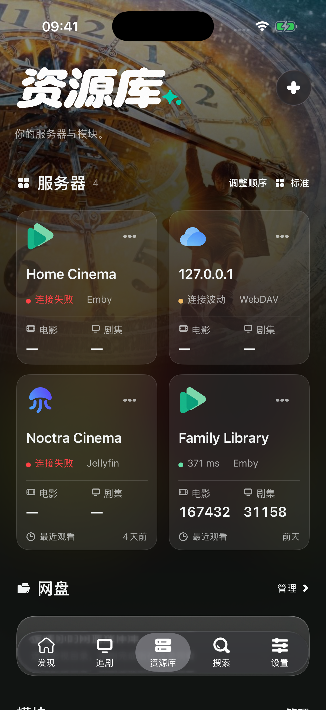
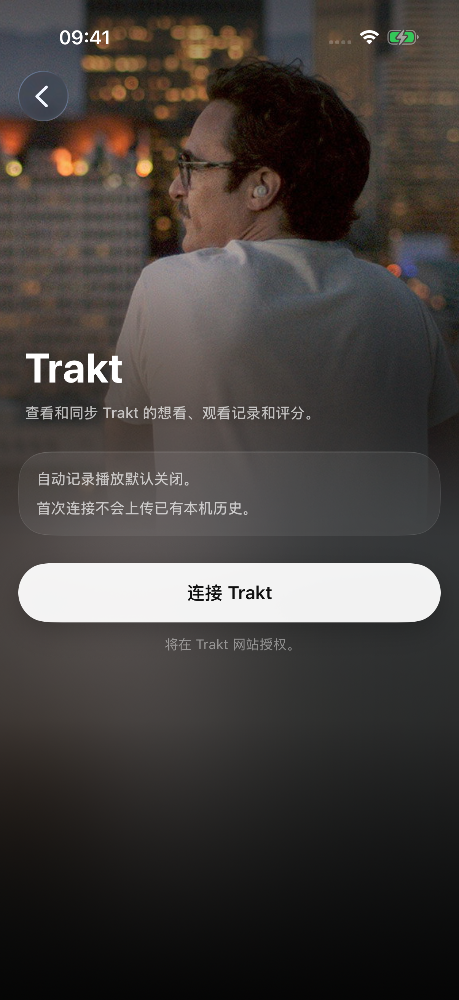
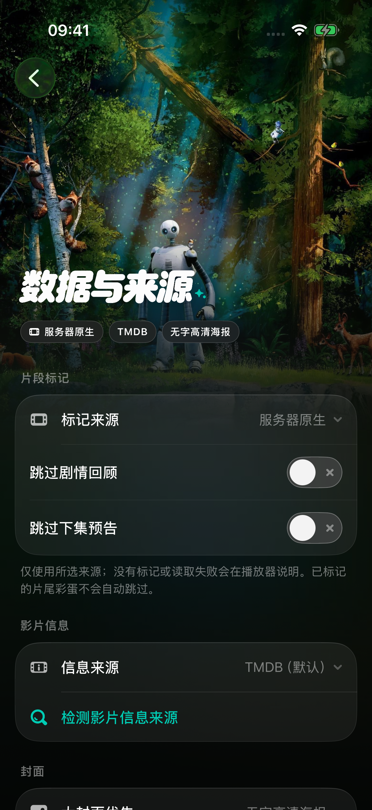
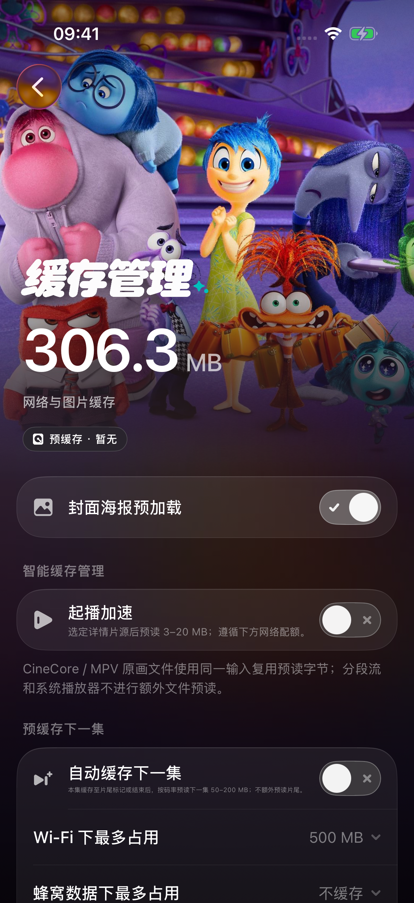

  
  <h1>Noctra</h1>
  
<b>把服务器、网盘和本地影片，放进自己的随身影院。</b>

  
在 iPhone 和 iPad 上整理片库、发现好片，接着上次的进度继续看。

  

    
    
    
  

  
<a href="#界面预览">界面预览</a> · <a href="#连接你的片库">支持的来源</a> · <a href="#播放">播放功能</a> · <a href="https://github.com/Lincb522/Noctra/issues">反馈与建议</a>

## 界面预览

经典沉浸 · 深色

<table>
  <tr>
    <td align="center"> 发现好片与继续观看</td>
    <td align="center"> 选择播放内核</td>
    <td align="center"> 字幕样式预览</td>
  </tr>
  <tr>
    <td align="center"> 弹幕显示与人物遮罩</td>
    <td align="center"> 聚合浏览与片源</td>
    <td align="center"> 多服务器管理</td>
  </tr>
  <tr>
    <td align="center"> Trakt 观影管理</td>
    <td align="center"> 影片数据与海报来源</td>
    <td align="center"> 缓存与预加载</td>
  </tr>
</table>

## 连接你的片库

| 来源 | 功能 |
| :--- | :--- |
| **Emby / Jellyfin / Plex** | 多服务器、多账号管理，浏览媒体库、搜索影片、选择片源和同步观看进度 |
| **SMB / WebDAV** | 连接 NAS 与远程文件夹，按目录浏览和播放视频 |
| **本地文件** | 添加本机或「文件」中的文件夹，整理和播放自己的视频 |
| **115 / 123 / 夸克网盘** | 扫码连接账号，浏览、搜索和播放网盘视频，建立海报媒体库 |

- **统一浏览与搜索**：汇总各来源的影片、最新入库、收藏与继续观看，也可以按服务器单独查看。
- **多版本片源**：同一部影片聚合展示，播放时选择服务器和具体版本；支持手动纠正匹配。
- **多线路管理**：保存局域网、公网或代理地址，批量识别线路文本，测速并选择合适线路。
- **首播来源排序**：为首次播放设置服务器优先顺序，续播沿用最近观看的来源与进度。
- **快速添加**：自动识别剪贴板中的地址、路径、账号和备用线路，支持保存连接草稿。
- **个性化卡片**：设置名称、备注、自定义 Logo 和白名单标识（SVIP），Logo 支持裁剪、缩放与旋转。
- **配置导入导出**：使用 JSON 或 ZIP 单个、批量迁移服务器配置，导入前预览并勾选，可选择携带登录凭据。

## 网盘媒体库

把散落在文件夹里的电影和剧集，整理成带海报、简介和季集信息的片库。

- 选择多个文件夹建立媒体库，自动识别影片、刮削资料、合并季集并关联同名字幕。
- 支持中英文片名、季年份与分集标题匹配，也可手动搜索、确认和纠正结果。
- 扫描任务支持暂停、继续、重启恢复和失败重试，可设置仅 Wi-Fi 扫描。
- 查看扫描进度与待确认项目，按批次处理大量文件。
- 网盘账号支持独立管理、卡片个性化和私密空间。

## 发现与观影管理

- **发现首页**：浏览今日趋势、动漫、播出平台、分类、电影公司与高分内容，自由调整首页栏目。
- **影片详情**：查看评分、剧情、主创、演员、制作信息、季集和相似作品，直接选择对应片源播放。
- **海报与片名 Logo**：从 TMDB、TheTVDB、Fanart.tv 选择封面、横幅和片名 Logo，支持中文素材。
- **继续观看**：按最近观看更新来源、季集与进度，返回首页即可接着看。
- **收藏、待看与私人影单**：按自己的习惯整理想看和喜欢的影片。
- **订阅与追剧日历**：查看更新数量、实际入库提醒和剧集排期。
- **观影记录与统计**：回顾看过的影片、观看时间和个人观影习惯。

## 播放

提供 **CineCore、MPV、系统播放器**三种引擎，播放器有**默认、影院、居中**三种布局。以下解码与画面处理能力以 **CineCore** 为主，可按片源和使用习惯选择内核。

### 视频解码与格式

| 类别 | 支持内容 |
| :--- | :--- |
| 主流视频编码 | H.264 / AVC、H.265 / HEVC，支持常见 8-bit、10-bit 与 4K UHD 片源 |
| 新一代编码 | AV1、VP9、VP8 |
| 其他视频编码 | MPEG-2、MPEG-4、VC-1、WMV、ProRes、Motion JPEG |
| 文件封装 | MKV、MP4、MOV、M4V、AVI、TS / M2TS、WebM、FLV |
| 流媒体 | HLS（M3U8）、MPEG-DASH |
| 解码方式 | Apple VideoToolbox 硬件加速与 FFmpeg 软件解码，可选择解码偏好并查看实际工作状态 |

### HDR 与杜比视界

- **HDR10 / HLG**：处理 PQ、HLG 高动态范围视频，保留 BT.2020 色彩信息、位深与可用的亮度元数据。
- **Dolby Vision P5**：通过原生杜比视界解码路径播放，处理 P5 专用色彩信号与配置。
- **Dolby Vision P7 / FEL**：解码基础层（BL）与增强层（EL），结合逐帧 RPU 元数据完成画面合成，以 BT.2020 / PQ、10-bit 画面送显。
- **Dolby Vision P8**：支持兼容 HDR 基础层的片源播放。
- **HDR10+ 元数据**：解析并传递逐帧动态元数据，在播放信息中查看送显帧的元数据状态。
- **动态范围与调色**：可选择自动 HDR 或映射为 SDR，调整亮度、对比度、饱和度、色温、锐度、降噪和去色带；MPV 提供自动、Spline、BT.2390 色调映射选项。
- **实际输出信息**：查看送显尺寸、位深、色彩信息和解码状态，了解当前片源的播放方式。

### 音频解码

| 类别 | 支持内容 |
| :--- | :--- |
| 常见音频 | AAC、MP3、Opus、Vorbis、PCM |
| 影院音轨 | Dolby Digital（AC-3）、Dolby Digital Plus（E-AC-3）、DTS、Dolby TrueHD |
| 无损音频 | FLAC、ALAC，以及 TrueHD 等无损音轨 |
| 多声道播放 | 多声道音轨在本机解码为 PCM，按当前扬声器、耳机或外接设备适配输出声道 |
| 声音调整 | 耳机虚拟环绕、音箱多声道模式、音轨切换与音画同步调节 |

具体硬解能力、流畅播放的分辨率和帧率，以及最终 HDR 与声道输出，由设备、系统版本、所选内核、片源规格和输出设备共同决定。

### 播放操作

| 功能 | 说明 |
| :--- | :--- |
| 画面调节 | 调整画面比例、缩放和播放速度 |
| 片源与轨道 | 播放中选择片源、音轨和字幕，直接切季、选集，浏览章节 |
| 进度预览 | 拖动进度条查看对应时间的画面，显示已播放与已缓存区间 |
| 起播加速 | 在详情页选定片源后提前准备少量视频数据 |
| 智能缓存 | 按播放进度提前准备下一集，设置缓存大小、网络配额与暂停缓存 |
| 手势操作 | 长按倍速、双击操作、横向调节进度、竖向调节亮度与音量、双指缩放 |
| 观看控制 | 画中画、锁定控制、片头片尾设置与连续播放 |
| 片源标识 | 自动识别编码、音频、封装、声道和片源版本，选择精工铭牌、胶片字标或自定义样式 |

## 字幕与弹幕

### 字幕

- 加载内嵌、外挂和在线字幕，支持 SRT、VTT、ASS / SSA 与图形字幕。
- 使用 ASSRT、SubHD、自定义字幕源和模块字幕源，读取 ZIP、RAR、7z 字幕包。
- 调整字号、颜色、位置、样式与时间偏移，边调整边预览。
- 字幕库支持分页、重命名和复用已下载字幕。
- 按影片、单集和服务器账号记住字幕选择及开关状态。
- 实时字幕与翻译支持设备端模型和自定义翻译 API。

### 弹幕

- 连接弹弹play 兼容接口、Bilibili XML 或模块弹幕源，匹配作品与集数。
- 调整密度、字号、透明度、速度和屏蔽词。
- 在关闭、单排、完整模式间快速切换，完整模式支持自动排数或 1—20 排。
- 人物遮罩让弹幕避开画面中的人物，HDR 亮度可独立调整。

## Trakt

将 Noctra 和 Trakt 连接起来，集中管理想看、已看和个人评分。

- **想看列表**：添加或移除电影、剧集，按类型筛选、搜索，并按时间、年份或片名排序。
- **观看记录**：将电影或单集标记为已看，自选观看时间，管理每一次观看记录。
- **个人评分**：为电影、剧集打 1—10 分，随时修改或移除评分。
- **自动同步**：按需开启播放状态上报和待看同步，为不同服务器分别设置上报方式。
- **同步管理**：手动同步，查看同步状态与待同步队列，对具体项目重试、核对或丢弃。
- **账号管理**：授权连接、重新连接与断开账号。

## 按自己的习惯使用

- **经典沉浸 / Noctra Mint**：两套界面主题，分别设置浅色、深色或跟随系统。
- **外观调整**：选择海报样式、悬浮导航栏、播放器布局与片源标识；iOS 26 可选择液态玻璃或毛玻璃按钮。
- **动效**：播放光盘转场、收藏票根和订阅动效可分别设置。
- **私密空间**：将服务器、网盘加入独立空间，通过 Face ID 或设备密码查看，进入后台自动锁定。
- **iCloud 同步**：在同一 Apple ID 的设备间同步服务器配置和个人设置。
- **缓存与能耗**：管理缓存、预加载与性能选项，按使用场景调整。
- **更新公告**：在设置中查看新功能与版本变化。
- **应用内反馈**：提交问题，附上截图或录屏，并查看历史反馈与回复。

## 开始使用

1. 在运行 **iOS / iPadOS 17 或更新版本**的 iPhone、iPad 上，通过 TestFlight 邀请安装 Noctra。
2. 在资源库添加服务器、文件夹或网盘，选择要浏览的内容。
3. 挑一部影片开始播放，在设置中调整主题、字幕、手势和播放习惯。

问题与建议可通过应用内「设置 → 问题反馈」提交，也欢迎到 [GitHub Issues](https://github.com/Lincb522/Noctra/issues) 交流。

---

**ZIJIU522 · Noctra**

功能与界面更新：2026 年 10 月 7 日
